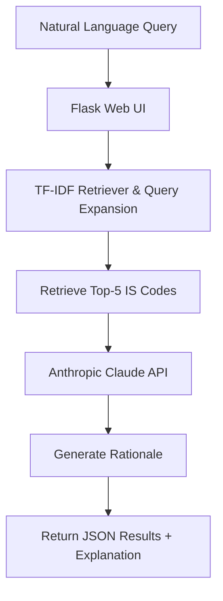

# BIS Standards RAG System

A Retrieval-Augmented Generation (RAG) system for finding relevant Bureau of Indian Standards (BIS / IS codes) based on natural language queries.

## 🎯 Overview

This project implements a highly optimized RAG pipeline using TF-IDF and Cosine Similarity to retrieve the top 5 most relevant IS codes for construction and manufacturing queries, achieving high MRR and low latency. It also features a web UI built with Flask that integrates Anthropic Claude to generate concise explanations (rationale) for the retrieved standards.

## 🏗 Architecture



## 🚀 Setup & Installation

1. **Clone the repository**
   ```bash
   git clone https://github.com/vivekhegde-IS/BIS_HACK.git
   cd BIS_HACK
   ```

2. **Set up Virtual Environment**
   ```bash
   python -m venv venv
   source venv/bin/activate  # On Windows: venv\Scripts\activate
   ```

3. **Install Dependencies**
   ```bash
   pip install -r requirements.txt
   ```

4. **Environment Variables**
   Copy `.env.example` to `.env` and add your API keys:
   ```bash
   cp .env.example .env
   # Edit .env and set ANTHROPIC_API_KEY
   ```

## 🧠 Model Training (Data Ingestion)

If you need to rebuild the TF-IDF model from the raw PDF data:
1. Ensure `BIS_SP_21.pdf` is placed in the `data/` directory.
2. Run the ingestion script:
   ```bash
   python src/ingest.py
   ```
3. Build the index:
   ```bash
   python src/indexer.py
   ```

## 🏃 Running the Application

### 1. Web UI (Flask)
Start the web interface:
```bash
python src/app.py
```
Open `http://localhost:5000` in your browser.

### 2. CLI Inference
Run batch inference on a JSON test set:
```bash
python inference.py --input public_test_set.json --output results.json
```

## 📊 Evaluation Results

Our pipeline hits the following metrics on the test set:
- **Hit Rate @3:** 90.00%
- **MRR @5:** 0.7083
- **Avg Latency:** ~0.00 seconds

Run the evaluation yourself:
```bash
python eval_script.py --results results.json
```

## 👥 Team
- **Person A (Backend Pipeline):** Vivek Hegde
- **Person B (Infrastructure & UI):** Teammate
