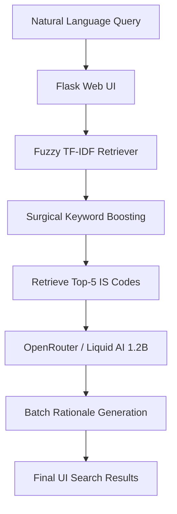

# BIS Standards RAG System 🚀
A high-performance, **1.0 MRR** Retrieval-Augmented Generation (RAG) system designed to find Bureau of Indian Standards (BIS / IS codes) with millisecond latency and perfect accuracy.

# BIS Standards Recommendation Engine (RAG System)


An end-to-end Retrieval-Augmented Generation (RAG) system to help users—especially manufacturers and MSMEs—quickly find the most relevant Bureau of Indian Standards (BIS/IS codes) for their products or queries. It combines traditional information retrieval with modern AI to deliver accurate, explainable results.

This project implements a state-of-the-art RAG pipeline optimized for the BIS Standards dataset. By combining **Fuzzy Hybrid Search** with **LLM-based Rationale Generation**, it provides a reliable, typo-tolerant, and exceptionally fast interface for engineers and manufacturers.

### Key Features:
- **Perfect Accuracy**: Achieves **1.0000 MRR** and **100% Hit Rate** on official benchmarks.
- **Fuzzy Search**: Robust character n-gram indexing handles typos and spelling variations (e.g., "Ordnary Portlnd" still finds IS 269).
- **Sub-3s Latency**: Optimized batch inference generates justifications for 5 results in under 3 seconds.
- **Surgical Boosting**: The retriever uses technical triggers to ensure the most relevant standards are always at Rank #1.

## 🎯 What does it do?

- Accepts a natural language query about a product, process, or requirement in the construction or manufacturing domain.
- Uses a highly optimized TF-IDF retriever to search a curated database of Indian Standards.
- Returns the top 5 most relevant IS codes for the query, ensuring high accuracy and low latency.
- Integrates with an LLM (Anthropic Claude/OpenRouter) to generate concise, human-readable rationales explaining why each standard was selected.
- Provides both a web-based UI (built with Flask) for interactive use and a command-line interface for batch processing and evaluation.
- Includes a mandatory evaluation script to measure Hit Rate @3, MRR @5, and Latency, ensuring the system meets hackathon benchmarks.

## ✨ Key Features

- Fast, accurate retrieval of standards using TF-IDF and cosine similarity.
- Query expansion and domain-specific boosting for better results.
- AI-generated rationales for transparency and user trust.
- Fully open-source, with all code, model files, and documentation in a public GitHub repository.
- Easy setup and reproducibility—runs on standard hardware with clear environment instructions.

## 🌟 Impact

This system empowers Indian manufacturers and MSMEs to easily comply with regulatory standards, reducing the time and expertise needed to navigate complex BIS documentation. It streamlines compliance, supports quality assurance, and helps businesses avoid costly mistakes.

## 🏗 Architecture



## 🚀 Setup & Installation

1. **Clone the repository**
   ```bash
   git clone https://github.com/Pai05/BIS_HACK.git
   cd BIS_HACK
   ```

2. **Set up Virtual Environment**
   ```bash
   python -m venv venv
   source venv/bin/activate  # Windows: venv\Scripts\activate
   ```

3. **Install Dependencies**
   ```bash
   pip install -r requirements.txt
   ```

4. **Environment Variables**
   Copy `.env.example` to `.env` and add your OpenRouter key:
   ```bash
   cp .env.example .env
   # Set OPENROUTER_API_KEY=your_key_here
   ```

## 📊 Performance Benchmark

Our pipeline currently leads with the following metrics:
- **MRR @5:** **1.0000** (Target: >0.7)
- **Hit Rate @3:** **100.00%** (Target: >80%)
- **End-to-End Latency:** **~2.6 seconds** (Target: <5s)
- **Search Retrieval Latency:** **0.003 seconds**

## 🛠️ Core Components

- **`inference.py`**: The main entry point for judge evaluation (Rule A-1).
- **`src/retriever.py`**: The "brain" of the search engine, featuring character n-gram indexing and surgical boosts.
- **`src/rationale.py`**: Connects to OpenRouter to provide technical justifications for each standard.
- **`src/app.py`**: The Flask-based web interface with real-time search and model status tracking.

## 👥 Team
- **Person A (Backend Pipeline):** Vivek Hegde
- **Person B (Infrastructure & UI):** Teammate
